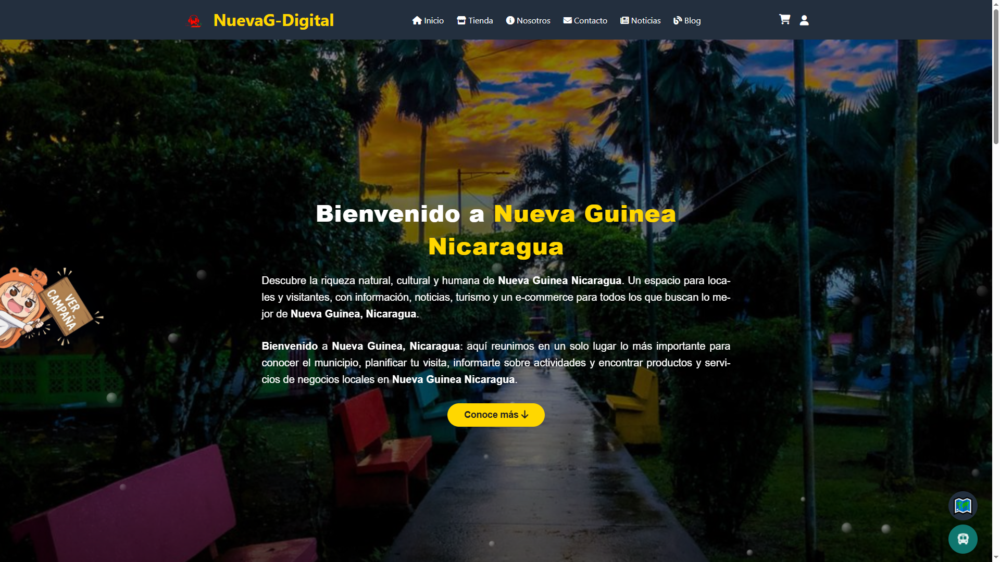
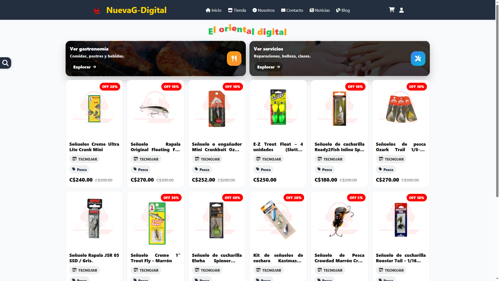
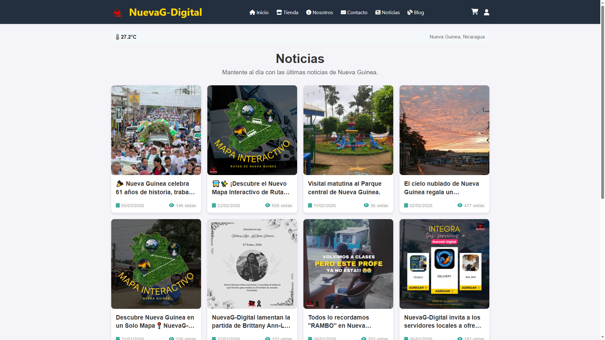
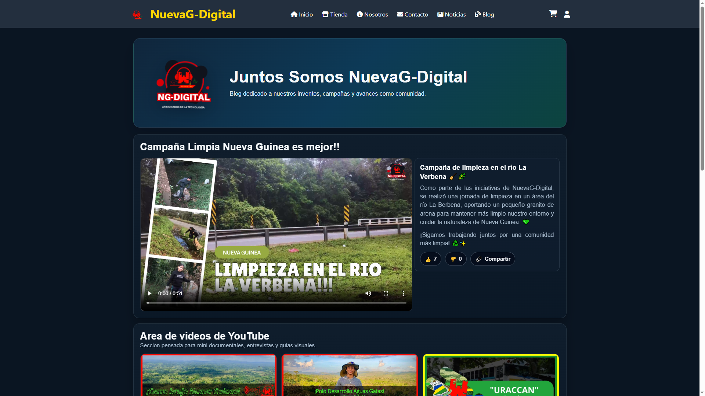

<div align="center">
  <a href="https://nuevaguineanicaragua.com/" target="_blank">
    
  </a>

# 🌿 Nueva Guinea Nicaragua — Portal Digital Oficial de la Comunidad
### 📰 Noticias • 🗺️ Turismo • 🛍️ E‑commerce local • 🤝 Comunidad

**Una ventana moderna para descubrir, conectar y crecer juntos en Nueva Guinea, Nicaragua.**

---

[](#)
[](#)
[](https://nuevaguineanicaragua.com/)

</div>

---

## ✨ ¿Qué es este proyecto?

**NuevaGuineaNicaragua.com** es un portal digital dedicado a **Nueva Guinea, Nicaragua**.  
Reúne información relevante de la zona, **noticias**, una guía de **turismo** y un espacio de **e‑commerce local**, con el objetivo de:

- Conectar a la comunidad
- Impulsar emprendedores y comercios
- Ofrecer a visitantes una vista clara de nuestras oportunidades y cultura

---

## 🎯 Misión

Promover el desarrollo integral de Nueva Guinea mediante la **tecnología y la comunicación**, facilitando el acceso a **información confiable** y creando espacios que fortalezcan la **economía, cultura y participación ciudadana**.

---

## 🌟 Visión

Ser el principal referente digital de Nueva Guinea: una plataforma **moderna, inclusiva y sostenible** que potencie el **turismo**, el **comercio local** y la **identidad** de nuestra comunidad.

---

## 🧩 Módulos del portal (secciones)

- 🏠 **Inicio**
- 🛍️ **Tienda**
- 👤 **Nosotros**
- ✉️ **Contacto**
- 📰 **Noticias**
- 📝 **Blog**

> Menú actual (referencia):  
> 

---

## 🖼️ Capturas (Screenshots)

Sube capturas de cada módulo a `docs/screenshots/` y enlázalas aquí.

### 🏠 Inicio
- `docs/screenshots/inicio.png`

### 🛍️ Tienda
- `docs/screenshots/tienda.png`

### 👤 Nosotros
- `docs/screenshots/nosotros.png`

### ✉️ Contacto
- `docs/screenshots/contacto.png`

### 📰 Noticias
- `docs/screenshots/noticias.png`

### 📝 Blog
- `docs/screenshots/blog.png`

### 🌐 Vista general (opcional)
- `docs/screenshots/preview.png` (banner/portada para el inicio del README)

```text
📌 TIP: usa nombres en minúsculas y sin espacios (inicio.png, tienda.png, etc.)
📌 TIP: tamaño recomendado: 1280x720 o 1920x1080 (JPG o PNG)
```

Cuando las tengas subidas, puedes mostrar la galería así:

```markdown
| Módulo | Captura |
|------:|:--------|
| Inicio |  |
| Tienda |  |
| Nosotros |  |
| Contacto |  |
| Noticias |  |
| Blog |  |
```

---

## 🚀 Demo / Producción

- 🌐 Sitio: https://nuevaguineanicaragua.com/

---

## 🌍 Opción extra: PWA (instalable)

Si el sitio se vuelve **PWA**, la gente puede “instalarlo” desde el navegador.
Incluye:
- Icono en pantalla de inicio
- Splash screen
- Cache offline (parcial o total según config)

---

## 🗺️ Roadmap (ideas)
- [ ] Directorio de negocios y emprendimientos
- [ ] Calendario cultural y eventos
- [ ] Sección “Visita Nueva Guinea” (guías, mapas, recomendaciones)
- [ ] Panel de administración para publicaciones
- [ ] Mejoras SEO y rendimiento
- [ ] PWA + notificaciones push

---

## 🤝 Contribución
¿Quieres apoyar el proyecto?

1. Propón mejoras (contenido, secciones, funciones)
2. Reporta errores o enlaces caídos
3. Aporta ideas de comercios locales o turismo

---

## 📬 Contacto
**Proyecto:** Nueva Guinea Nicaragua  
**Web:** https://nuevaguineanicaragua.com/

---

<div align="center">

### 🌿 “Tecnología y comunicación al servicio de nuestra comunidad.”  
**Hecho con orgullo para Nueva Guinea, Nicaragua.**

</div>
